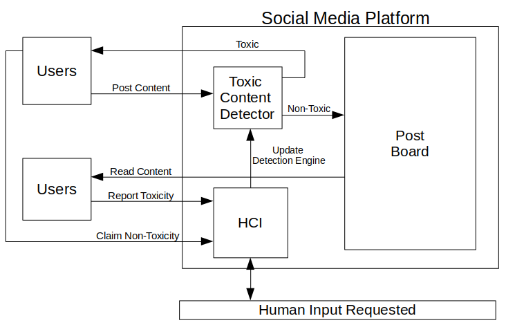
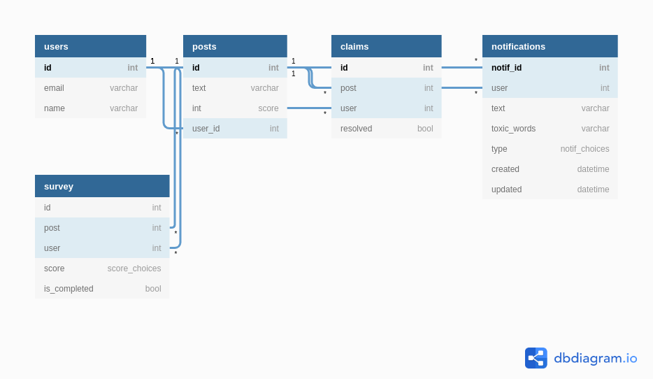
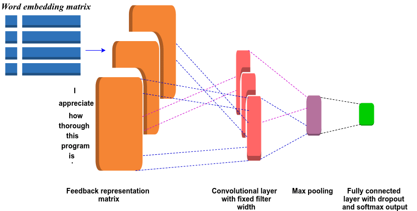
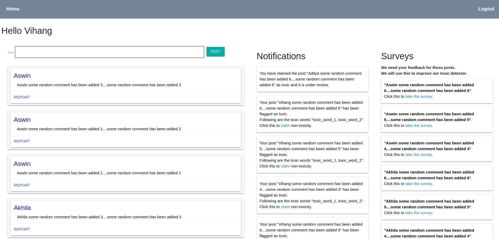
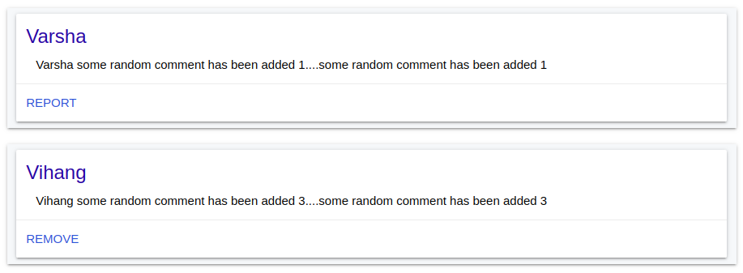
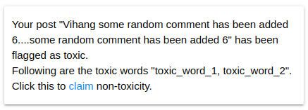
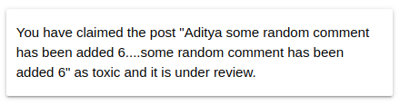
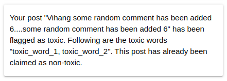
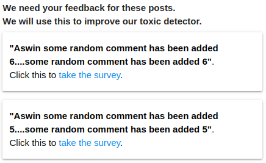
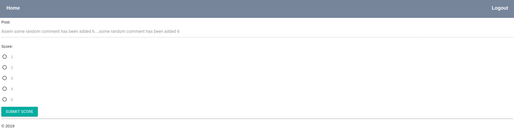

# Toxic Content detection on social media platforms

## Motivation
Cyberbullying and online abuse have been continuously rising at an alarming rate. This is detrimental to the mental state of teenagers and one of the biggest factors leading to depression. Manually determining the toxicity of the comments in the plethora of data generated on a daily basis is an impossible task. Automating the detection and censorship of such toxic comments by the social media platforms can go a long way in solving this issue. But detection of toxic comments is a very daunting task because of various factors such as context, perception, vocabulary etc.

In this work, we propose including the human element to the system to work with along with the automated model to improve the results by requesting feedback. We are using a recurrent neural network (RNN) with a long-short term memory cell (LSTM) and a convolutional neural network (CNN).

Additionally, we use the pre-trained FastText embedding from Facebook and Global Vectors for Word Representation (GloVe) embedding as the backbone of the automated system and introduce the human feedback in the recurring training. Instead of doing a binary classification of comments, we will rather provide a range. In our human feedback system as well, we would request feedback on a scale rather than a simple yes/no.

## System Design

*Figure 1: Toxicity Detection System Layout*

As can be seen from figure 1 whenever a user wants to post content on a social media platform, this content gets filtered by the toxic content detector. If the content is non-toxic, it is posted successfully on the social media platform. But if the content is identified to be toxic (any kind of toxic such as hate, abusive etc.), the user is notified and may be warned. But as we know that this system alone is not enough to yield good performance due to various caveats. The comments might be taken out of context, or it might contain various slang words, the severity of the toxicity also matters at times. 

To address these issues we have to incorporate the human component to the system. In cases when toxic comments go undetected and are posted on social media, it can be reported by the users. So when a claim of non-toxicity is made, or some content is reported as toxic, the HCI kicks in and publishes a survey which asks a randomly chosen group of users to give feedback on the nature of the content. 

But we cannot just ask a binary question regarding the toxicity of the content. Some content can be clearly classified as completely toxic and some as completely non-toxic, but sometimes things are not so clear. Some may categorize the content as mildly toxic, while some might say that it is highly toxic. To overcome this we introduced a 1-5 scale for the level of toxicity in our survey. Combining this data in a useful manner was an interesting challenge. We decided to use the median score as the metric to judge the appropriate toxicity level and use it to improve and evolve our model.

Once we have the public feedback, it is fed to the Toxic Content Detection Engine in batches to update the detection mechanism and hopefully make it more robust and capable of detecting such scenarios successfully in the future.

## Database Design

*Figure 2: Database design*

Figure 2 shows the database schema of our system. We decided that we won't be working too much on user authentication as it is not the main focus of this project. To that effect, we decided to only use email of user as the login credential, i.e. no password system. The email gets stored in the table named **users**. The table has a primary key named **id** to uniquely identify each user. This unique identificationis used in deciding the content of various views like claims, survey, etc.

We also have a table named **posts** to store the posts andinformation about the user who posted it - done via foreignkey named *user_id*. The attribute **score** stores the scoregiven to a post by our Toxic Content Detector (TCD).

The **claims** table is used to store the posts that havebeen flagged as either toxic by TCD or reported toxic by someuser. The **survey** table is used for storing the feedback byvarious users on a post. We use the information from this table in improving our system. There is also a **notification** table which stores all the messages and their status.

## Toxic Content Detector (TCD) Design

*Figure 12: CNN Text classification Model*

To create a toxic content detection model, we picked a dataset which contains **159571** instances of Wikipedia comments that have been annotated by human raters. We use pre-trained embeddings from Facebook FastText and Global vectors for word representation(GloVe) embeddings. We apply a deep neural network (DNN) with a Convoluted NeuralNetwork cell (CNN) our dataset.

### Data Preprocessing

We first pre-processed the comment texts by removing any non-english comments, removing escape characters, special characters, HTML tags, website/email links, etc. Then we converted all text to lower case and padded those sentences that were short. We kept our maximum comment length to be of 160.

### Word Embeddings
A simple way of encoding words of a dictionary is to have one hot vector encoding of the words in the dictionary. This is generally a very sparse representation and can’t identify similar but semantically close words in the natural language. One hot embedding represents every word as a new dimension in the mathematical vector space which is independent of each other. The dot product between any two of these is zero, which is not very helpful. This is the motivation for word embeddings in a smaller dimensional space. In a nutshell, word embeddings are just vector representation of words in a small dimensional space(generally 50, 100, 300). First, it is a very efficient representation of the words. Second, it is far more expressive than one-hot encoding as it keeps the similarity between similar words in natural language. Generally, the word embeddings are trained as part of the task itself, but there are already good embeddings available like GloVe, FastText etc. Instead of training all the word embeddings from scratch we used particularly the GloVe (100d) and FastText (300d) word em-beddings and tuned the word embeddings to our task by training it along with the neural network training itself.

### Model
In standard NLP text classifying problems like ours, the bag of word model is used. This states that the vocabulary and frequency of occurrence of words is taken into account rather than its semantic context. Despite the simplicity of this approach, for text categorization tasks it shows good performance. CNNs have two major parts:
1. **The Feature extraction part** - In this, the network applies a number of convolutions and pooling operations to help detect the features. If we had an image of a lion, this is the part where the network would recognize the different body parts like four legs.
2. **The Classification part** - It is the fully connected layer, which serves as a classifier on top of the extracted features. They assign a probability for the comment on the label, being what the model predicts it is. We run the model predictions in real-time which are really fast - approx. 1 sec.

### Naive Bayes
This is a simple (naive) classification method based on Bayes rule. It relies on a very simple representation of the document (called the bag of words representation). Occurrence count (frequency) is good if word counts of all the documents are more or less the same. However, re-views text length varies greatly. For longer documents, it will have higher average count values than shorter documents, even though they might talk about the same topics. To avoid these potential discrepancies it suffices to divide the number of occurrences of each word in a document by the total number of words in the document: these new features are called Term Frequencies(tf ). After normalizing our dataset, we trained the multinomial classifier from sklearn library of python and saved the model and tf-idf vectorizer files in pickle format. We used these files to generate real-time predictions on each word in a comment and categorized them as toxic if the toxicity score returned was greater than 50 per cent. 

Thus, as shown in figure 6,7,8 the comments have been predicted as toxic by our CNN model. The words found toxic in the comments have been predicted by our Naive Bayes model.

## Interface Design

Figure 4 shows our proxy for social network sites like Facebook, Twitter, Reddit, etc.. We are calling itAggie Hub. The interface will show all the posts submitted by different users. The user can post their posts by typing in the textbox and clicking on the post button. If the post is detected as non-toxic by our Toxic Content Detector (TCD) in the background, meaning that the probability of it being non-toxic is greater than a threshold, say, 50%, it will be shown in the post-board.
Figure 5 again shows our Aggie Hub. As mentioned before the user will be able to see all the posts in this dashboard. If the posts were falsely detected as non-toxic by TCD and some other user wants to flag/report those as toxic, they can use the interface shown in fig5 to do so.

Figure 6 shows our interface for dealing with potential false negatives from our toxic Content Detector (TCD). This becomes useful when a post by a user is detected as toxic by TCD. In such a scenario the user is notified about his/her post. The user has the option to claim the post as non-toxic. If the user makes the non-toxicity claim, a notification like the one shown in fig 7 is added to the notifications section, and the notification shown in fig 6 is changed to 8 in order to reflect this.

Figure 4 shows the homepage, in this if you notice the notifications section in the centre of the screen, this is where the user can check the status of all the claims that he has made.

Whenever a user reports a post as toxic (see Figure 5) or claims a post as non-toxic (see Figure 6), our system stores the concerned posts in a table. In order to improve ourToxicContent Detector (TCD), we continuously pick various posts from the table and create a survey which we send to various users to get their views. Figure 9 shows the interface of our community survey. On clicking this the users are taken to the survey page as shown in fig 10. We ask users to rate each post on a scale of 1 to 5 with 1 being non-toxic and 5being most toxic. Before re-training our TCD, which is done offline, we look at all the feedback obtained from the survey and aggregate the ratings based on some metric - average, median or mode. These selected set of posts are added to the training corpus and gets used in the training the model. In this way, our TCD continuously improves by relying on the community.

Images            |  Images
:-------------------------:|:-------------------------:
 | 
*Figure 4: Home Page*  |  *Figure 5: Post posted by logged in user has Remove option, while posts by other users show Report option*
 | 
*Figure 6: Notification informing detection of Comment as Toxic* | *Figure 7: Notification informing the non-toxicity claim*
 | 
*Figure 8: Notification informing the result of the claim* | *Figure 9: Survey List*
 | 
*Figure 10: Incorporating the community in the loop* | *Figure 12: CNN Text classification Model*

<!-- Link for google forms : https://forms.gle/UAbo7cLouu8bNRHH8 -->
